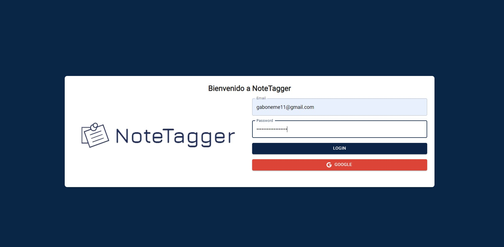
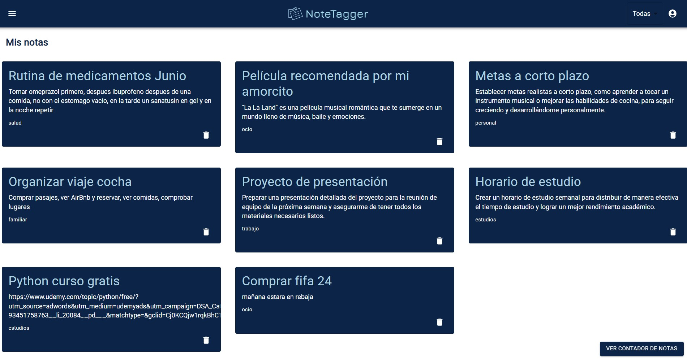

# NoteTagger-Proyecto Gestion de Notas📓
## Objetivo y descripcion del proyecto.📌
_NoteTagger es una aplicación web que te permite organizar tus notas de manera eficiente. Crea, guarda y filtra tus notas por categoría para acceder rápidamente a la información que necesitas. Además, ofrece almacenamiento local para acceder a tus notas sin conexión a internet. Simplifica tu vida y mantén tus pensamientos ordenados con NoteTagger._

## Requisitos del proyecto.💻
* Utilización de useState para controlar estados.
* Utilización de useEffect.
* Utiliza useMemo.
* Utilización del almacenamiento local (localStorage).
* Utiliza memo para optimizar el rendimiento de los componentes y evitar renderizados innecesarios.
* Utiliza useRef.
* Utiliza useContext.
* Utiliza react-router-dom.
* Implementa un formulario utilizando react-hook-form.
* Utiliza Material-UI o Tailwind CSS para diseñar y estilizar la interfaz de usuario de la aplicación.
* Implementa guards de autenticación utilizando react-router-dom para proteger las rutas que requieren autenticación.
* Asegúrate de que el proyecto esté bien organizado en componentes reutilizables, siguiendo las mejores prácticas de estructura de carpetas y nombres de archivos.

## Instalacion.🔧

1. Debemos clonar nuestro repositorio ejecutando el comando:

        git clone https://github.com/GaboRex/CertiReact-SegundoParcial.git

2. Con nuestro proyecto clonado abriremos nuestra terminal y entraremos a la ruta donde guardamos el proyecto.        

        cd /ruta/noteTagger

3. Una vez en nuestro directorio del proyecto procederemos a ejecutar el comando para instalar todas las dependencias necesarias:

        npm install
4. Para finalizar ejecutaremos el siguiente comando para poder visualizar e interactuar con la pagina web:
        
        npm run dev

5. Disfruta de nuestra interfaz amigable y registra todos tus eventos con nosotros.

### **Login**

### **Notas**

### **Añadir notas**

## Video-Presentacion🎞

## Autor:✒️

* **Gabriel Neme** -[GaboRex](https://github.com/GaboRex)
* **Codigo:** 56189
